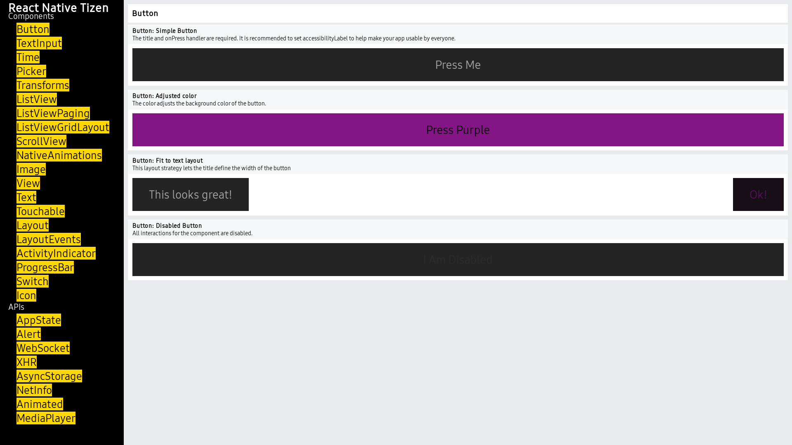

A basic button component that should render nicely on any platform. Supports
a minimal level of customization.

<center></img></center>

Button is original style in Tizen. If this button doesn't look right for your app, you can build your own
button using [TouchableOpacity](touchableopacity.md)
or [TouchableHighlight](touchablehighlight.md).

Example usage:

```javascript
import { Button } from 'react-native';
...

<Button
  onPress={onPressLearnMore}
  title="Learn More"
  color="#841584"
  accessibilityLabel="Learn more about this purple button"
/>
```

### Props

- [`onPress`](docs/button.html#onpress)
- [`title`](docs/button.html#title)
- [`color`](docs/button.html#color)
- [`disabled`](docs/button.html#disabled)


---

# Reference

## Props

### `onPress`

Handler to be called when the user taps the button

| Type | Required |
| - | - |
| function | Yes |


---

### `title`

Text to display inside the button

| Type | Required |
| - | - |
| string | Yes |


---

### `color`

Color of the text (iOS), or background color of the button (Android)

| Type | Required |
| - | - |
| [color](docs/colors.html) | No |


---

### `disabled`

If true, disable all interactions for this component.

| Type | Required |
| - | - |
| bool | No |


