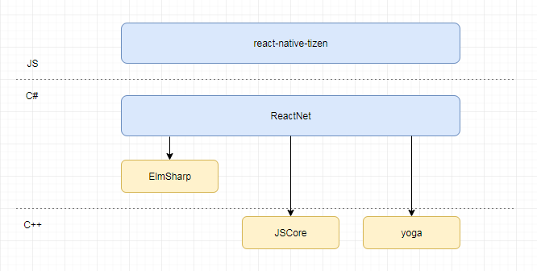

# react-native-tizen-dotnet
React Native is an open source framework for building native apps with React.JS. It is supported in Android, iOS and Windows currently.

**react-native-tizen-dotnet** is a React Native framework for developer to build Tizen.NET apps on Tizen.  
It provides the same fundamental UI components and user experience with Tizen native Apps. Also it provides a easy and fast debugging way with Hot Module Reloading feature.

Currently, react-native-tizen-dotnet based on [react-native 0.42](https://github.com/facebook/react-native/tree/0.42-stable) and [react-native-windows 0.42](https://github.com/Microsoft/react-native-windows/tree/0.42-stable).  

## Components & APIs Documents

react-native-tizen-dotnet not realized all Components and APIs of react-native.  
Detail reference to [docs](Docs/doc-index.md).

## Source Code Directory Structure

```diff
react-native-tizen-dotnet
├── Devtools/ - Development tool .
├── Docs/ - Components & APIs Documents.
├── Example/ - Example of react-native-tizen-dotnet App.
└── Framework/ - react-native-tizen-dotnet Framework.
    ├── react-native-tizen/ - JS Library.
    └── ReactNet/ - Native Framework based on .NET Code.
```




## Getting Started
-   $ ```sudo npm i -g create-react-native-tizen-app```
-   $ ```create-create-native-tizen-app myTizenApp```
-   $ ```cd myTizenApp```
-   $ ```vim package.json``` //change "tvip": "192.168.100.1" to your Tv IP
-   $ ```yarn bundle``` // for release mode
-   $ ```yarn bundle --dev``` // for dev mode, js file not ugly
-   $ ```yarn package``` // packaging tpk for Tizen
-   $ ```yarn launch``` // launch tpk to Tizen TV , Before launch you need run shell on tizen board

## Connect to TV
Refer to this website, **Enable Developer Mode on the TV**:
https://developer.samsung.com/tv/develop/getting-started/using-sdk/tv-device


